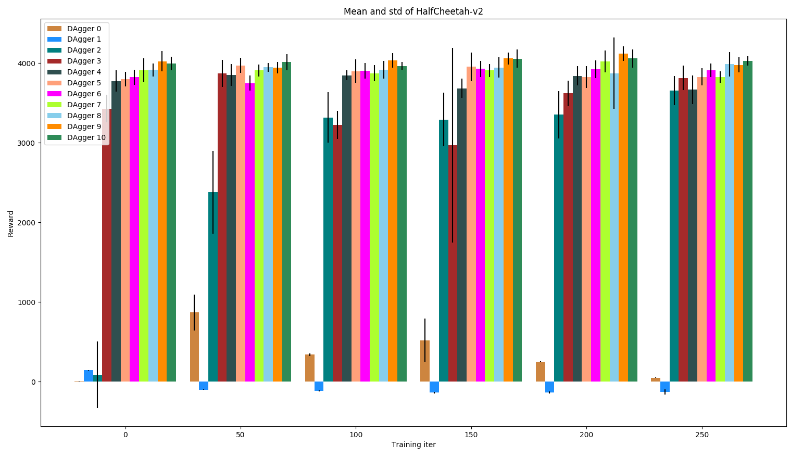
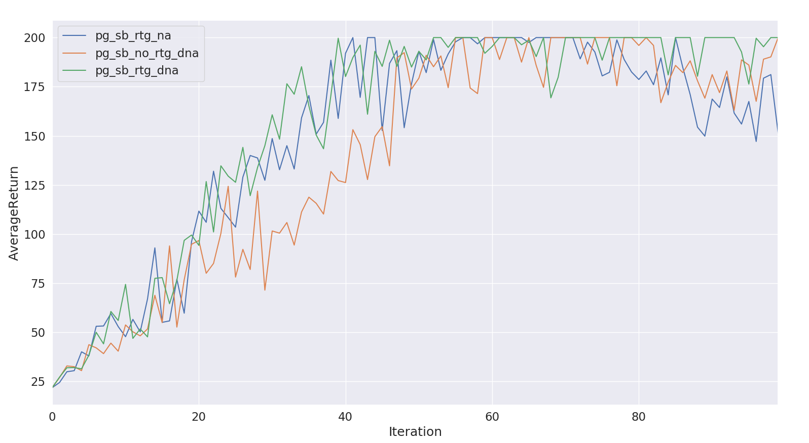
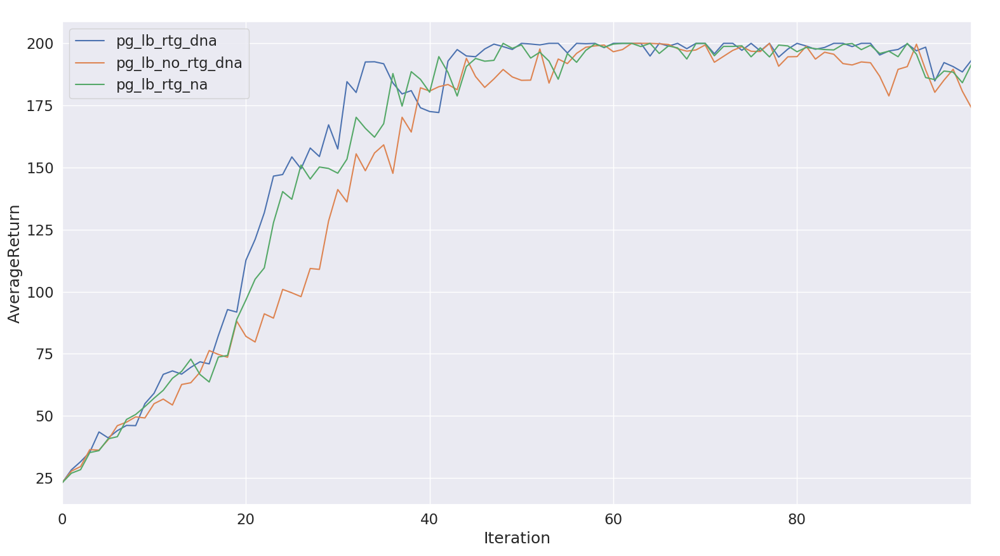
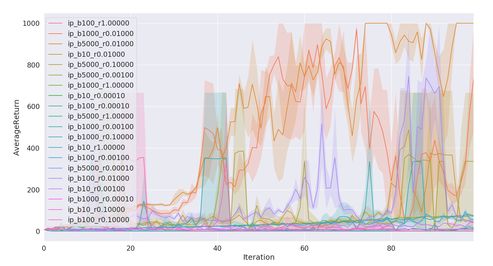
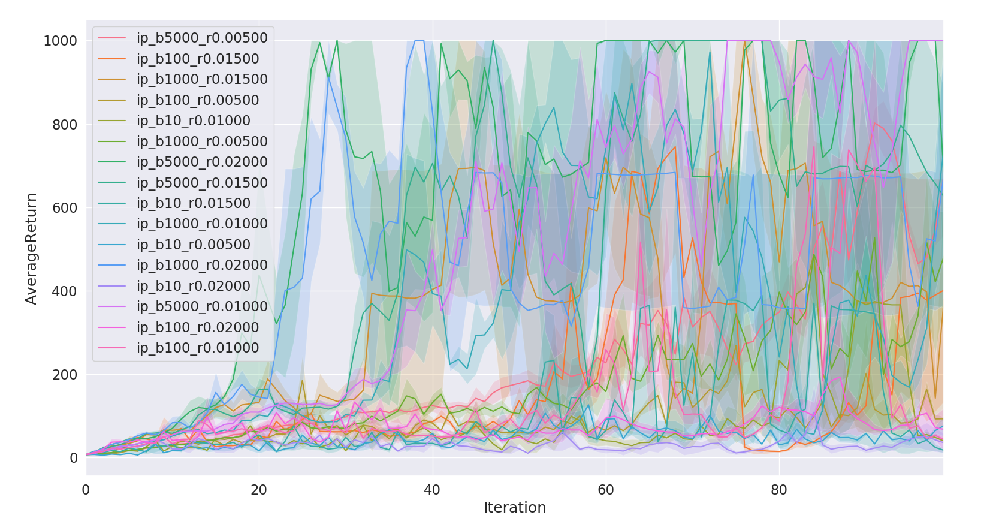
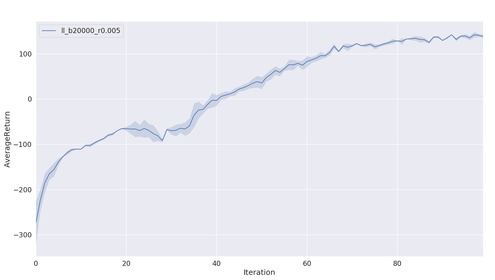

# Homework of CS294-112 at UCB

## Preface

This is a my implementation of the homework of CS294-112 at UCB. All codes have been tested under PyTorch **1.0**.
Thanks to [Markpen](https://github.com/PengZhenghao/CS294-Homework)

## Usage

You can run `bash run.sh` file at each directory, which contains generate the expert data, behavioral cloning and data aggregate three phases. 
In order to save time, the data aggregate phase just give the Hopper-v2.

## HW1: Behavioral Cloning

We use a 4-layer MLP as the policy network. The next table presents the hyperparameter used for this experiment.

| Hyperparameter       | Value |
|----------------------|-------|
| Expert rollouts  | 20    |
| Training epoches | 300    |
| Maximal Data Aggregate iters | 10 |
| Data Aggregate rollouts | 50 |
| Learning rate        | 1E-04 |
| Training batch size  | 128    |
| Test rollouts          | 20     |

The following tables and figures show the experimental results. The results of the baseline method are the rewards gained by the expert networks. We can see that the behavioral cloning method are unalbe to compare to the expert network. With data aggregation, most of the models can get the same performance with the expert network. Some of them even are better than the expert network. 

### Ant-v2 

| Method             | Mean Return | Standard Deviation |
|:--------------------:|:-------------:|:--------------------:|
| Expert           |  4649.069    | 780.630           |
| Behavioral Cloning |  1017.552    |  37.492            |
| Data Aggregation  | 4821.571 | 77.497 |

### HalfCheetah-v2
| Method             | Mean Return | Standard Deviation |
|:--------------------:|:-------------:|:--------------------:|
| Expert           | 4126.121    | 85.402             |
| Behavioral Cloning | 867.088     | 222.831            |
| Data Aggregation  | 4059.706 | 113.824 |

### Hopper-v2
| Method             | Mean Return | Standard Deviation |
|:--------------------:|:-------------:|:--------------------:|
| Expert           | 3778.351    | 3.933              |
| Behavioral Cloning | 296.395     | 9.002              |
| Data Aggregation  | 3771.281 | 7.009 |

### Humanoid-v2
| Method             | Mean Return | Standard Deviation |
|:--------------------:|:-------------:|:--------------------:|
| Expert           | 10410.438   | 66.743            |
| Behavioral Cloning | 370.704     | 63.819             |
| Data Aggregation  | 4531.564 | 3049.694 |

### Reacher-v2
| Method             | Mean Return | Standard Deviation |
|:--------------------:|:-------------:|:--------------------:|
| Expert           | -4.088      | 1.654              |
| Behavioral Cloning | -6.844     | 1.664              |
| Data Aggregation  | -3.945 | 1.414 |

### Walker2d-v2
| Method             | Mean Return | Standard Deviation |
|:--------------------:|:-------------:|:--------------------:|
| Expert           | 5526.236    | 50.480             |
| Behavioral Cloning | 17.218     | 1.275              |
| Data Aggregation  | 4682.141 | 1047.966 |

## HW2: Policy Grandient

### Prolbem4. CartPole 
Run the PG algorithm in the discrete CartPole-v0 environment with the setting as follows:
* -n 100 -b 1000 -e 3 -dna --exp_name sb_no_rtg_dna
* -n 100 -b 1000 -e 3 -rtg -dna --exp_name sb_rtg_dna
* -n 100 -b 1000 -e 3 -rtg --exp_name sb_rtg_na
* -n 100 -b 5000 -e 3 -dna --exp_name lb_no_rtg_dna
* -n 100 -b 5000 -e 3 -rtg -dna --exp_name lb_rtg_dna
* -n 100 -b 5000 -e 3 -rtg --exp_name lb_rtg_na
Then graph the results of the experiments using the plot.py file. 
#### Small batch size

#### Large batch size

### Problem 5. InvertedPendulum
Run experiments in InvertedPendulum-v2 continuous control environment. In order to find smallest batch size and largest learning rate more easily, parameter `--param_search` is set. Two experiments have been maken, the batch size are [10, 100, 1000, 5000], one learning rate is \in [0.0001, 0.001, 0.01, 0.1, 1], the other is \in [0.005, 0.01, 0.015, 0.02]. 
#### Coarse Search [0.0001, 0.001, 0.01, 0.1, 1]

#### Fine search [0.005, 0.01, 0.015, 0.02]

### Problem 7. LuanarLander
Before starting this experiment, the box2d-py must be installed. The result is as follows:

The batch size is 40000, which I made a mistake

