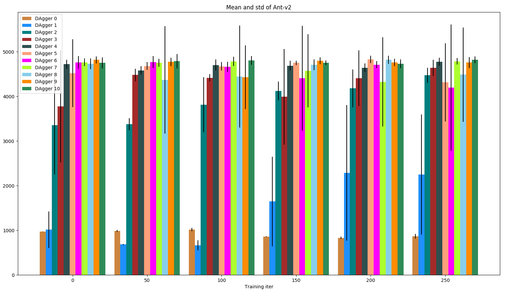
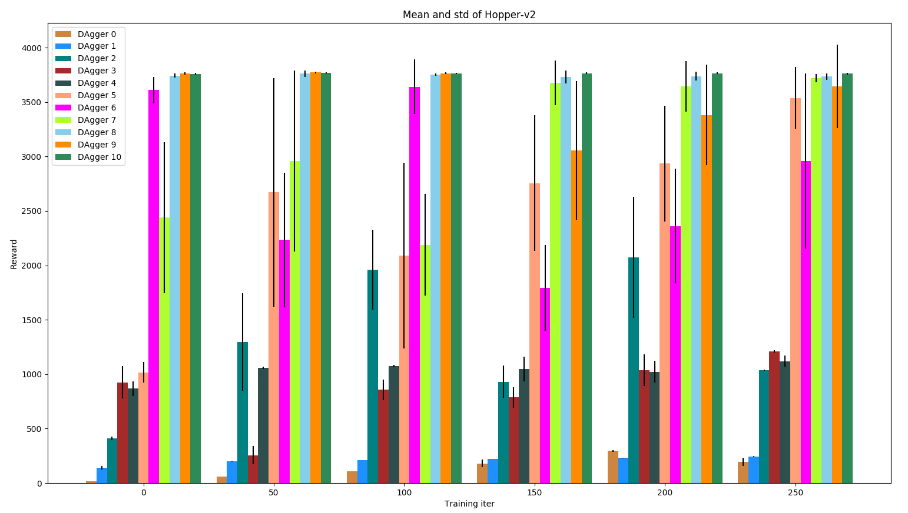
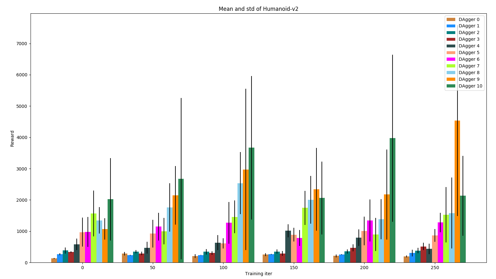
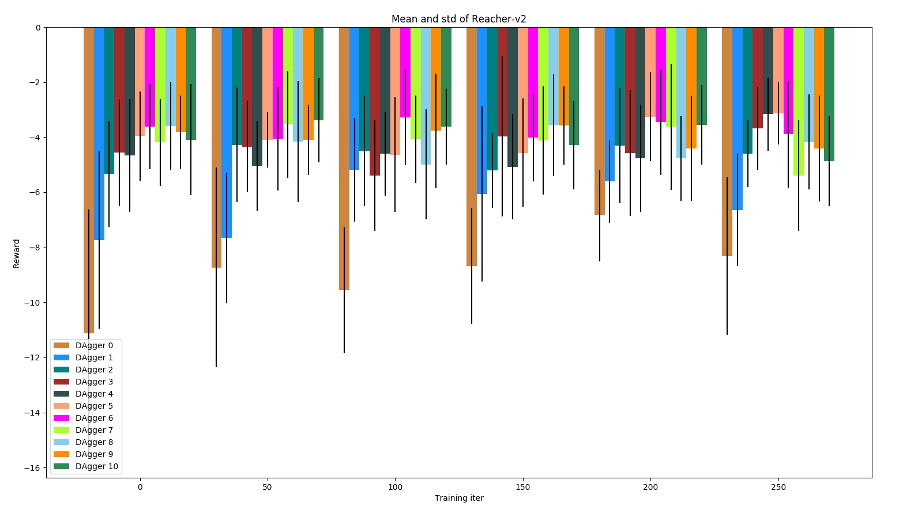
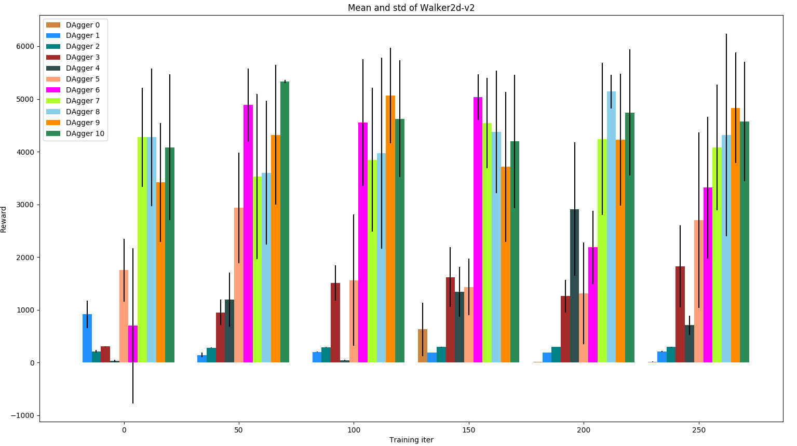

# Homework of CS294-112 at UCB

## Preface

This is a my implementation of the homework of CS294-112 at UCB. All codes have been tested under PyTorch **1.0**.
Thanks to [Markpen](https://github.com/PengZhenghao/CS294-Homework)

## Usage

You can run `bash run.sh` file at each directory, which contains generate the expert data, behavioral cloning and data aggregate three phases. 
In order to save time, the data aggregate phase just give the Hopper-v2.

## HW1 (Behavioral Cloning)

We use a 4-layer MLP as the policy network. The next table presents the hyperparameter used for this experiment.

| Hyperparameter       | Value |
|----------------------|-------|
| Expert rollouts  | 20    |
| Training epoches | 300    |
| Maximal Data Aggregate iters | 10 |
| Data Aggregate rollouts | 50 |
| Learning rate        | 1E-04 |
| Training batch size  | 128    |
| Test rollouts          | 20     |

The following tables and figures show the experimental results. The results of the baseline method are the rewards gained by the expert networks. We can see that the behavioral cloning method are unalbe to compare to the expert network. With data aggregation, most of the models can get the same performance with the expert network. Some of them even are better than the expert network. 

### Ant-v2 

| Method             | Mean Return | Standard Deviation |
|:--------------------:|:-------------:|:--------------------:|
| Expert           |  4649.069    | 780.630           |
| Behavioral Cloning |  1017.552    |  37.492            |
| Data Aggregation  | 4821.571 | 77.497 |

### HalfCheetah-v2
| Method             | Mean Return | Standard Deviation |
|:--------------------:|:-------------:|:--------------------:|
| Expert           | 4126.121    | 85.402             |
| Behavioral Cloning | 867.088     | 222.831            |
| Data Aggregation  | 4059.706 | 113.824 |

### Hopper-v2
| Method             | Mean Return | Standard Deviation |
|:--------------------:|:-------------:|:--------------------:|
| Expert           | 3778.351    | 3.933              |
| Behavioral Cloning | 296.395     | 9.002              |
| Data Aggregation  | 3771.281 | 7.009 |

### Humanoid-v2
| Method             | Mean Return | Standard Deviation |
|:--------------------:|:-------------:|:--------------------:|
| Expert           | 10410.438   | 66.743            |
| Behavioral Cloning | 370.704     | 63.819             |
| Data Aggregation  | 4531.564 | 3049.694 |

### Reacher-v2
| Method             | Mean Return | Standard Deviation |
|:--------------------:|:-------------:|:--------------------:|
| Expert           | -4.088      | 1.654              |
| Behavioral Cloning | -6.844     | 1.664              |
| Data Aggregation  | -3.945 | 1.414 |

### Walker2d-v2
| Method             | Mean Return | Standard Deviation |
|:--------------------:|:-------------:|:--------------------:|
| Expert           | 5526.236    | 50.480             |
| Behavioral Cloning | 17.218     | 1.275              |
| Data Aggregation  | 4682.141 | 1047.966 |

